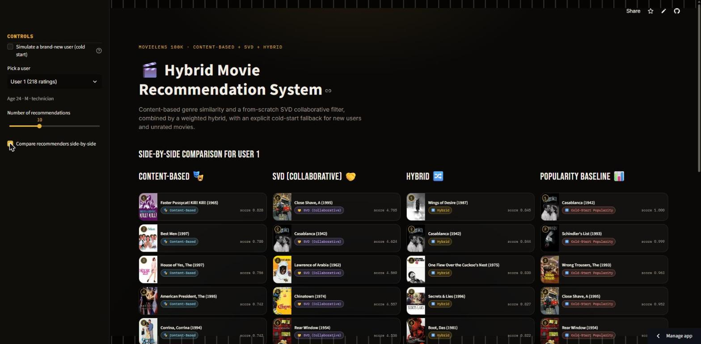
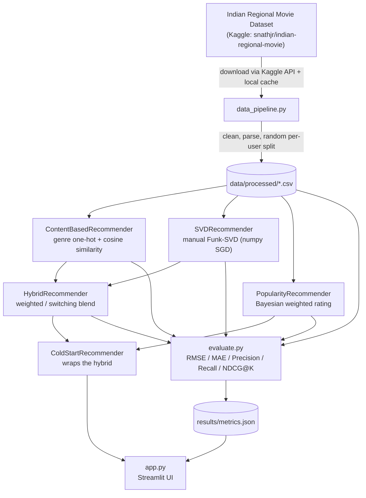

# Hybrid Movie Recommendation System

A production-style movie recommender built on the **Indian Regional Movie Dataset**
(Agarwal et al., 2018 — real per-user preference signal across 18 Indian regional
languages, not just movie metadata): genre-based content filtering, a from-scratch SVD
collaborative filter, a weighted hybrid of the two, and an explicit cold-start fallback
for new users and unrated movies — all wrapped in a Streamlit demo that shows which
model actually served each recommendation.

**Live demo:** https://aswin-hybrid-movie-recommender.streamlit.app/

## Problem statement

Recommender systems in production rarely rely on a single technique. Collaborative
filtering (SVD) captures rating patterns across users but is blind to brand-new users
and brand-new items — it has nothing to factorize for them. Content-based filtering
(genre similarity) has the opposite failure mode: it works from the first rating and
never needs collaborative history, but it only ever recommends "more of the same" and
its rating estimates are poorly calibrated. This project builds both, combines them
into a hybrid, and — the part that's usually hand-waved in portfolio projects — makes
the cold-start fallback an explicit, testable code path instead of scattered
`if user not in ratings` checks. It also reports what happens when hybrid blending
*doesn't* pay off (see [Real evaluation results](#real-evaluation-results)) rather than
cherry-picking the dataset where it does.

## Screenshot



The "compare side-by-side" view — each column is a different model serving the same
user, tagged with the `source` it actually ran under (`content`, `svd`, `hybrid`,
`cold_start`).

## About the dataset

MovieLens — the standard benchmark for this kind of project — has essentially no
Indian-cinema representation (it's a 1997/98 US student-rating dataset). This project
uses the **Indian Regional Movie Dataset** ([Agarwal et al., arXiv:1801.02203](https://arxiv.org/abs/1801.02203)),
mirrored on Kaggle as [`snathjr/indian-regional-movie`](https://www.kaggle.com/datasets/snathjr/indian-regional-movie),
instead. Two of its properties are load-bearing enough to shape the whole codebase, not
just a data-loading detail:

- **Ratings are ternary, not 1–5 stars**: `1` = liked, `0` = disliked/not interested,
  `-1` = ambiguous/skipped. `src/models.py` treats `[-1, 1]` as the native rating range
  rather than forcing a fake 5-star scale onto an implicit-style preference signal —
  RMSE/MAE here measure preference-*score* prediction, not star-rating prediction.
- **No timestamp field exists**, so the train/test split is random per-user rather than
  chronological (see [Design decisions](#design-decisions)).

Real numbers after cleaning: **908 users, 2,850 movies, 20,529 ratings** (16,703
train / 3,826 test). 21 genres, with about a quarter of the catalog carrying no genre
tag at all. `movie_id` is the movie's real IMDb `tt` id (used as-is, not remapped to a
synthetic integer) and `user_id` is the free-text handle survey respondents typed in —
both are strings throughout the codebase. A dozen obviously-fake survey submissions
(ids like `"n"`, `"p"`, or literally `"ABCDEFGHI JKLM"`) are filtered out in
`src/data_pipeline.py`. **License is not clearly stated** by the dataset's authors or
its Kaggle mirror ("unknown" per Kaggle) — this project uses it for non-commercial,
educational/portfolio purposes only, with the original paper cited above.

## Architecture



## Real evaluation results

Generated by `python -m src.evaluate`, saved to
[`results/metrics.json`](results/metrics.json). Ranking metrics are computed against
the **full 2,850-movie catalog with no negative sampling** — harder than the
sampled-candidate protocol common in papers/tutorials, so the absolute numbers read
lower, but they aren't inflated by an easier evaluation setup. "Relevant" means the
user explicitly marked a test movie liked (`rating == 1`), matching this dataset's
ternary scale.

| Model | RMSE ↓ | MAE ↓ | Precision@5 ↑ | Recall@5 ↑ | NDCG@5 ↑ | Precision@10 ↑ | Recall@10 ↑ | NDCG@10 ↑ |
|---|---|---|---|---|---|---|---|---|
| Popularity baseline | 0.5948 | 0.4719 | **0.0138** | **0.0333** | **0.0222** | **0.0133** | 0.0625 | 0.0339 |
| Content-based | 0.8760 | 0.7138 | 0.0026 | 0.0078 | 0.0061 | 0.0021 | 0.0104 | 0.0070 |
| SVD (collaborative) | **0.5607** | **0.4049** | 0.0122 | 0.0282 | 0.0204 | 0.0130 | **0.0667** | **0.0344** |
| Hybrid (weighted, α=0.6) | 0.6187 | 0.4938 | 0.0125 | 0.0286 | 0.0206 | 0.0129 | 0.0598 | 0.0328 |

**Headline result, reported honestly rather than the MovieLens experiment's story
recycled onto different data: hybrid wins nothing outright here.** SVD wins
rating-prediction accuracy (RMSE/MAE) and the longer-list ranking metrics (Recall@10,
NDCG@10); the plain **popularity baseline actually wins every @5 ranking metric and
Precision@10**. See [Why the hybrid doesn't win here](#why-the-hybrid-doesnt-win-here-and-why-thats-still-a-real-result)
for why, and why that's still a meaningful result rather than a failed experiment.

## Design decisions

**SVD implementation: manual Funk-SVD via numpy, not `surprise` or `implicit`.**
`surprise` is unmaintained and its C-extension build frequently fails on Windows and
on free hosting tiers (Streamlit Community Cloud, HF Spaces) with newer numpy/Python —
exactly the platforms this project targets. `implicit` is built for implicit-feedback
ALS; this dataset's ternary signal is *closer* to implicit feedback than MovieLens's
explicit ratings were, but the hand-written SGD loop over user/item biases + latent
factors (the same model family as the Netflix Prize "Funk SVD") still applies cleanly —
it's parameterized entirely by `RATING_MIN`/`RATING_MAX` in `src/models.py`, so
retargeting it from a 1–5 scale to a -1..1 preference-score scale was a two-constant
change, not a rewrite. Fits in a few seconds on this dataset's ~16.7K training ratings
(50 factors, 20 epochs, train RMSE 0.64 → 0.48).

**Dataset access requires a free Kaggle API token — the one piece of setup this project
can't make disappear.** Unlike MovieLens's unauthenticated public URL, Kaggle gates
every dataset download behind its API. `src/data_pipeline.py`'s
`download_indian_movies_dataset` raises an actionable `DataDownloadError` pointing at
kaggle.com/settings if no token is configured. See [Run locally](#run-locally).

**Train/test split: random, per user — not chronological.** The MovieLens version of
this pipeline used a per-user *chronological* split specifically to avoid training on a
user's future ratings to predict their past ones. This dataset carries no timestamp at
all (see [About the dataset](#about-the-dataset)), so that split isn't possible here —
a per-user **random** split is the honest next-best option. It's still done *per user*
(not on some artificial global order) so every active user contributes to both sets,
which a global split wouldn't guarantee. Users with fewer than 5 ratings are kept
entirely in train (the cold-start regime, handled separately). See
`random_train_test_split` in `src/data_pipeline.py` for the full reasoning, including
what a chronological split *would* have bought that this one can't.

**Cold-start as a wrapper, not scattered if/else.** `ColdStartRecommender` wraps any
other recommender and owns both fallback rules in one place: users with fewer than 5
training ratings get genre-matched popularity recommendations instead of the base
model's output; movies with zero training ratings always get a global-popularity
rating estimate, since the base model has no signal to have learned anything about
them. Every real user in this dataset already has training ratings by construction, so
the Streamlit app includes a "simulate a brand-new user" toggle (a sentinel `user_id`
absent from training data) — it's the only way to see this path trigger against real
model state instead of just trusting the unit tests.

### Why the hybrid doesn't win here (and why that's still a real result)

On MovieLens, blending content-based similarity into SVD improved ranking quality even
though it cost some RMSE — a legitimate "hybrid earns its complexity" story. On this
dataset it doesn't, and forcing the same conclusion onto different numbers would be
exactly the kind of dishonesty this project's evaluation methodology (full-catalog
ranking, no negative sampling, real held-out data) exists to avoid. Two real
differences in the data explain why:

1. **The content signal is much weaker here.** About a quarter of this catalog has no
   genre tag at all, and even tagged movies typically carry only 1–2 of the 21 genres —
   thinner combinatorial signal than MovieLens's fuller genre coverage. Content-based
   alone is the worst model on *every* metric in the table above, more decisively than
   in the MovieLens experiment.
2. **The rating signal is sparser and more implicit.** ~20.5K ratings spread across
   2,850 movies (only 1,274 ever get a training rating) is an order of magnitude
   sparser than MovieLens 100K's ratio, and a ternary like/dislike/skip signal carries
   less information per rating than a 1–5 star scale. In that regime, a well-calibrated
   popularity prior is hard to beat for short ranked lists, and blending in a
   comparatively weak content signal mostly adds noise rather than complementary
   signal.

The honest takeaway: **hybrid blending is not a free lunch — its benefit is
data-dependent**, and this project now has real evidence of both a regime where it
helps (MovieLens, see this repo's git history for those numbers) and one where it
doesn't. `alpha=0.6` was not re-tuned for this dataset; a real next step would be
sweeping `alpha` and the switching threshold against this data specifically rather than
reusing the value picked for MovieLens.

## Project structure

```
Recommendation_system/
├── claude.md              # engineering log: decisions, tradeoffs, verified status per phase
├── README.md
├── requirements.txt
├── pyproject.toml         # pytest config (pythonpath so `src` resolves)
├── .gitignore
├── .streamlit/
│   ├── config.toml        # committed: base dark theme
│   └── secrets.toml       # gitignored: local TMDB_API_KEY / Kaggle creds live in ~/.kaggle instead
├── data/                  # gitignored; auto-populated by the pipeline on first run
│   ├── raw/
│   └── processed/
├── results/
│   └── metrics.json       # committed — real numbers, not regenerated per deploy
├── src/
│   ├── __init__.py
│   ├── data_pipeline.py   # download (Kaggle API), clean, random per-user split
│   ├── models.py          # ContentBased / SVD / Hybrid / Popularity / ColdStart
│   ├── evaluate.py        # RMSE, MAE, Precision/Recall/NDCG@K, comparison table
│   ├── posters.py         # optional TMDb poster lookup, by IMDb id or title
│   └── utils.py           # logging config, shared paths
├── app.py                 # Streamlit demo
├── tests/                 # pytest tests across pipeline, models, evaluation, posters
└── screenshots/
```

## Run locally

```bash
git clone <this-repo-url>
cd Recommendation_system
python -m venv venv
venv\Scripts\activate       # Windows
# source venv/bin/activate  # macOS/Linux
pip install -r requirements.txt
```

**One extra step this project can't avoid: a free Kaggle API token.** Sign in (or
create a free account) at kaggle.com, go to **kaggle.com/settings → API → Create New
Token**, and save the downloaded `kaggle.json` to `~/.kaggle/kaggle.json` (or set the
`KAGGLE_USERNAME`/`KAGGLE_KEY` environment variables instead). Then:

```bash
streamlit run app.py
```

On first launch (empty `data/`), the app downloads the dataset via the Kaggle API,
cleans and splits it, and trains all five models. Every subsequent launch reuses the
pipeline's on-disk cache and Streamlit's `@st.cache_data`/`@st.cache_resource`, so it's
fast.

Real movie posters (optional): get a free TMDb API key at themoviedb.org → Settings →
API, and set it as the `TMDB_API_KEY` environment variable or in
`.streamlit/secrets.toml`. Without one, the app still runs — every card falls back to a
styled placeholder instead of a real poster.

To regenerate `results/metrics.json` after changing a model or hyperparameter:

```bash
python -m src.evaluate
```

To run the test suite (data pipeline + every model + evaluation metrics + poster
lookup):

```bash
pytest tests/ -v
```

## Tech stack

Python 3.12 · pandas · numpy · scikit-learn (cosine similarity only — no library SVD)
· scipy · Streamlit · kaggle (dataset access) · requests (TMDb posters) · pytest

## Notes on this build

This project originally targeted MovieLens 100K; it was rebuilt around the Indian
Regional Movie Dataset specifically to demonstrate the recommender system on Indian
cinema rather than the default Hollywood-heavy benchmark. Built with Python 3.12 rather
than 3.11 (the latter wasn't available on the dev machine used) — no code depends on a
3.11-only feature, so this has no practical effect on the app or its deployment target.
