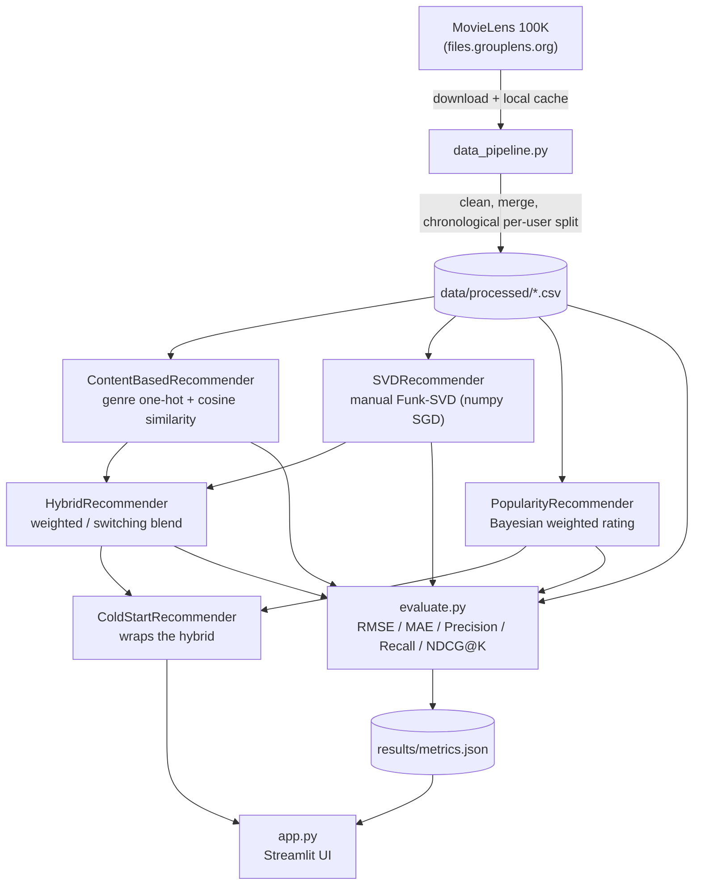

# Hybrid Movie Recommendation System

A production-style movie recommender built on **MovieLens 100K**: genre-based content
filtering, a from-scratch SVD collaborative filter, a weighted hybrid of the two, and
an explicit cold-start fallback for new users and unrated movies — all wrapped in a
Streamlit demo that shows which model actually served each recommendation.

**Live demo:** _coming soon — added here after deployment._

## Problem statement

Recommender systems in production rarely rely on a single technique. Collaborative
filtering (SVD) captures rating patterns across users but is blind to brand-new users
and brand-new items — it has nothing to factorize for them. Content-based filtering
(genre similarity) has the opposite failure mode: it works from the first rating and
never needs collaborative history, but it only ever recommends "more of the same" and
its rating estimates are poorly calibrated. This project builds both, combines them
into a hybrid, and — the part that's usually hand-waved in portfolio projects — makes
the cold-start fallback an explicit, testable code path instead of scattered
`if user not in ratings` checks.

## Screenshot

_Not yet captured — this session didn't have browser access to take one. The app was
verified headlessly with Streamlit's `AppTest` harness instead (see "Design Decisions"
below). Run `streamlit run app.py` locally and drop a screenshot in `screenshots/` to
fill this in._

## Architecture



## Real evaluation results

Generated by `python -m src.evaluate`, saved to
[`results/metrics.json`](results/metrics.json). Ranking metrics are computed against
the **full 1,682-movie catalog with no negative sampling** — harder than the
sampled-candidate protocol common in papers/tutorials, so the absolute numbers read
lower, but they aren't inflated by an easier evaluation setup.

| Model | RMSE ↓ | MAE ↓ | Precision@5 ↑ | Recall@5 ↑ | NDCG@5 ↑ | Precision@10 ↑ | Recall@10 ↑ | NDCG@10 ↑ |
|---|---|---|---|---|---|---|---|---|
| Popularity baseline | 1.1086 | 0.8963 | 0.0567 | 0.0285 | 0.0570 | 0.0558 | 0.0540 | 0.0627 |
| Content-based | 1.4229 | 1.1528 | 0.0194 | 0.0086 | 0.0211 | 0.0162 | 0.0156 | 0.0205 |
| SVD (collaborative) | **0.9868** | **0.7813** | 0.0501 | 0.0242 | 0.0534 | 0.0464 | 0.0407 | 0.0545 |
| **Hybrid (weighted, α=0.6)** | 1.0505 | 0.8568 | **0.0574** | **0.0267** | **0.0639** | 0.0483 | 0.0458 | 0.0620 |

**Headline result:** SVD alone wins on rating-prediction accuracy (lowest RMSE/MAE),
but the **hybrid wins on ranking quality** (best Precision@5 and NDCG@5 of all four
models) — despite content-based alone being the weakest model on every metric. That's
the actual point of building a hybrid: content similarity adds enough complementary
signal to improve *what gets ranked to the top*, even though on its own it's bad at
estimating *what rating a user would give*.

## Design decisions

**SVD implementation: manual Funk-SVD via numpy, not `surprise` or `implicit`.**
`surprise` is unmaintained and its C-extension build frequently fails on Windows and
on free hosting tiers (Streamlit Community Cloud, HF Spaces) with newer numpy/Python —
exactly the platforms this project targets. `implicit` is built for implicit-feedback
ALS, not explicit 1–5 star rating prediction, so it's the wrong tool for this dataset.
A hand-written SGD loop over user/item biases + latent factors (the same model family
as the Netflix Prize "Funk SVD") avoids both problems, adds no risky dependency, and
is a better artifact to walk through in an interview than "I called `.fit()` on a
library". It fits in ~12s on MovieLens 100K (50 factors, 20 epochs, train RMSE
1.03 → 0.78).

**Train/test split: chronological, per user — not random/stratified.** A random split
lets the model train on a user's *later* ratings to predict *earlier* ones, which the
model could never actually observe in production; that's leakage wearing a good-RMSE
costume. A chronological split reproduces the real deployment condition (predict the
future from the past). It's done *per user* rather than on the global timeline so
every active user contributes to both sets — a global-timeline split would put some
users' ratings entirely in train or entirely in test whenever their activity clusters
in time, making per-user ranking metrics impossible to compute for them. Users with
fewer than 5 ratings are kept entirely in train (that's the cold-start regime,
handled separately). See `chronological_train_test_split` in `src/data_pipeline.py`.

**Cold-start as a wrapper, not scattered if/else.** `ColdStartRecommender` wraps any
other recommender and owns both fallback rules in one place: users with fewer than 5
training ratings get genre-matched popularity recommendations instead of the base
model's output; movies with zero training ratings always get a global-popularity
rating estimate, since the base model has no signal to have learned anything about
them. Every real MovieLens 100K user already has 20+ ratings by construction, so the
Streamlit app includes a "simulate a brand-new user" toggle (a sentinel `user_id`
absent from training data) — it's the only way to see this path trigger against real
model state instead of just trusting the unit tests.

**Why hybrid, given SVD wins on RMSE?** Rating-prediction accuracy and ranking quality
are different objectives, and the results table shows they don't move together here.
Blending in content similarity costs a bit of RMSE (the raw content signal is poorly
calibrated to the 1–5 scale) but improves what actually gets surfaced at the top of
the list — which is what a recommender is used for. This is a deliberately honest
result: it would have been easy to only report RMSE and call SVD the winner, but the
ranking metrics are the ones that matter for the product surface this app actually has.

## Project structure

```
Recommendation_system/
├── claude.md              # engineering log: decisions, tradeoffs, verified status per phase
├── README.md
├── requirements.txt
├── pyproject.toml         # pytest config (pythonpath so `src` resolves)
├── .gitignore
├── data/                  # gitignored; auto-populated by the pipeline on first run
│   ├── raw/
│   └── processed/
├── results/
│   └── metrics.json       # committed — real numbers, not regenerated per deploy
├── src/
│   ├── __init__.py
│   ├── data_pipeline.py   # download, clean, chronological split
│   ├── models.py          # ContentBased / SVD / Hybrid / Popularity / ColdStart
│   ├── evaluate.py        # RMSE, MAE, Precision/Recall/NDCG@K, comparison table
│   └── utils.py           # logging config, shared paths
├── app.py                 # Streamlit demo
├── tests/                 # 41 pytest tests across pipeline, models, evaluation
└── screenshots/
```

## Run locally

```bash
git clone <this-repo-url>
cd Recommendation_system
python -m venv venv
venv\Scripts\activate       # Windows
# source venv/bin/activate  # macOS/Linux
pip install -r requirements.txt
streamlit run app.py
```

Nothing else is required. On first launch (empty `data/`), the app automatically
downloads MovieLens 100K (~5MB), cleans and splits it, and trains all five models —
roughly 15–20 seconds, mostly spent on the SVD SGD loop. Every subsequent launch reuses
the pipeline's on-disk cache and Streamlit's `@st.cache_data`/`@st.cache_resource`, so
it's fast.

To regenerate `results/metrics.json` after changing a model or hyperparameter:

```bash
python -m src.evaluate
```

To run the test suite (41 tests, data pipeline + every model + evaluation metrics):

```bash
pytest tests/ -v
```

## Tech stack

Python 3.12 · pandas · numpy · scikit-learn (cosine similarity only — no library SVD)
· scipy · Streamlit · pytest

## Notes on this build

This project targets **MovieLens 100K**, not 1M, specifically to stay within the
memory limits of free hosting tiers (~1GB on Streamlit Community Cloud / HF Spaces
free CPU). Built with Python 3.12 rather than 3.11 (the latter wasn't available on the
dev machine used) — no code depends on a 3.11-only feature, so this has no practical
effect on the app or its deployment target.
